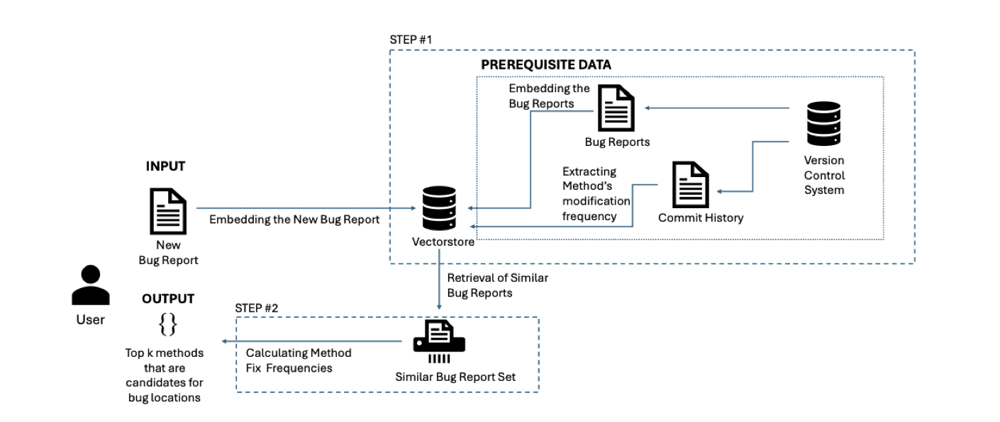

# BUGFS: Method-Level Bug Localization by Counting Method Modifications of Similar Bug Reports

## 📖 Overview

BUGFS (**BUG** location recommendation using method **F**requency of **S**imilar bug reports) is a novel approach for **method-level bug localization**.  
It combines **semantic similarity** between bug reports and the **historical frequency of method modifications** to recommend the most likely buggy methods.

> 🧠 **Key idea:**  
> If a method was frequently modified in similar past bug reports, it is likely to require modification again for a new bug.

Compared to state-of-the-art methods such as **FineLocator** and **MblShl**, BUGFS achieves:
- **1.5× higher Precision@10**, **1.2× higher Recall@10**
- **3.0× higher MAP**, **3.4× higher MRR**
- Consistent performance across **Java (Ant, AspectJ, Maven)** and **Python (Django, Flask, Pandas)** projects.

<p align="center">
  
</p>

## ⚙️ MCP Bug Localization Server
The new `bug_locator_mcp_server.py` exposes a Model Context Protocol (MCP) server that automates everything from crawling issues to recommending buggy methods:

| Tool | Purpose |
| --- | --- |
| `crawl_repo` | Uses `crawl_issues_With_diffs.py` to download GitHub issues plus their fixing commit patches. |
| `embed_repo` | Reuses `embedding.py` logic to embed each issue’s title/body with OpenAI embeddings. |
| `run_BUGFS` | Implements the `run_rq1` methodology to retrieve similar issues and rank file:function locations by vote frequency. |

### Setup
1. `pip install modelcontextprotocol openai python-dotenv requests numpy`
2. Add `OPENAI_API_KEY` and `GITHUB_TOKEN` to your environment (or a `.env` file).

### Running locally
```
python bug_locator_mcp_server.py
```
Once the server is running you can add it to any MCP-compatible client. Typical workflow:
1. `crawl_repo(owner="pallets", repo="flask")`
2. `embed_repo(owner="pallets", repo="flask", model="text-embedding-3-small")`
3. `run_BUGFS(owner="pallets", repo="flask", title="Bug title", body="Bug body...")`
